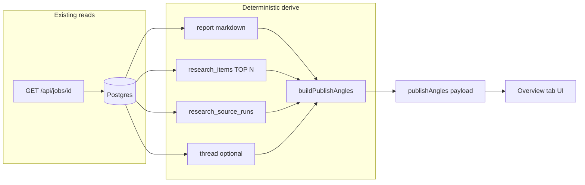

# Publish Angles (Article Opportunities) — Implementation Plan

> **For execution:** Use the `executing-plans` skill to implement this plan task-by-task.

**Goal:** Surface high-signal, source-backed publishing opportunities from existing run data in underused UI space, with deterministic ranking first and optional minimal LLM polish—without a CMS, new crawlers, or heavy infrastructure.

**Architecture:** Extend the existing job detail payload and run-page “Research output” workspace so “Overview” becomes a **scan layer for editorial angles** (cards + structured previews) built from `reports.content`, `research_items`, and `research_source_runs`, reusing patterns from `lib/job-page/report-preview.ts`, `lib/job-page/editorial-digest.ts`, and `lib/research/thread-insight.ts`. Optional Phase-2 POST route mirrors `app/api/jobs/[id]/ai-recap/route.ts` for polish-only LLM calls on top-N candidates.

**Tech stack:** Next.js 14 (App Router), React 18, Drizzle + Postgres, Zod, existing HF/Gemini thread-compression stack for any optional refinement.

---

## 1. Fit with current codebase and product architecture

- **Threads and runs:** `researches` aggregate many `research_jobs`; each run already persists `reports`, `research_items` (scored, sourced), and `research_source_runs`. Job detail is served by `app/api/jobs/[id]/route.ts` and rendered by `app/job/[id]/page.tsx`.
- **Deterministic truth:** The markdown report remains canonical; this feature **derives** angles from it and from stored items, similar to `buildReportPreview` and `EditorialDigest`.
- **Existing AI layer:** Run recap (`app/api/jobs/[id]/ai-recap/route.ts`) already composes a small context (`buildRunRecapContext`, top items capped). Any LLM for publish angles should follow the same constraints: **small context, eligibility gates, quality check**.
- **Thread-level signals:** `loadThreadDetailForResearch` already exposes `threadInsight`, `sincePreviousRun`, and per-run `insightLine`; cross-run “momentum” can reuse these when `researchId` is present on the job.

---

## 2. Recommended scope — Phase 1 (shippable minimal additive)

- **Single primary surface:** Run page — **Research output → Overview** tab (`output-workspace__panel` when `activeTab === "overview"`). Today this tab is mostly static copy; it is the lowest-risk “dead space” that stays contextually tied to the run.
- **Deterministic-only:** Server computes a **Publish angles** payload from data already loaded for the job (ideally **same GET** as `/api/jobs/[id]` to avoid extra requests).
- **UI:** 2–3 fixed card patterns only:
  1. **Article opportunity** — headline + 1-line “why publishable” + 2–3 bullet outline (deterministic) + “Sources” chips linking to existing `research_items` (by id/url).
  2. **Trend / momentum** — reuse thread insight when thread exists; else source-volume line from `research_source_runs`.
  3. **Topic cluster** — two buckets only (align with `DigestBucketId`: learn vs discuss) showing top titles/snippets, no fancy graph layout.
- **Actions:** Copy-to-clipboard for a single angle (markdown or plain text). **No** auto-publish, no drafts stored in DB in Phase 1.
- **Explicitly out of Phase 1:** New external feeds, background workers, persisted angle history, multi-user CMS, randomized layouts.

---

## 3. UX use of dead-space (concrete)

| Area | Current state | Proposed use |
|------|----------------|--------------|
| Job page → Overview tab | Four generic muted paragraphs | Replace lower half (keep 1–2 lines of orientation) with **Publish angles** section: stacked cards, same `section-title` / `section-hint` / `product-surface` visual language as `globals.css`. |
| Home right column (`home-workspace__continuity`) | Recent threads list | **Phase 2:** When latest run succeeded, show **one** compact “Continue as article” teaser linking to `/job/{id}` with anchor `#publish-angles` — optional, avoids duplicating full panel on home. |

**Accessibility:** Region label `aria-label="Publishing angles"`; cards as `<article>` or `li` in list; links reuse external-link patterns if any exist.

---

## 4. Data flow (jobs / threads / reports / runs)



- **Phase 1:** `buildPublishAngles` runs inside `GET` handler after existing queries (or immediately after assembling the same rows in memory). No new worker.
- **When thread linked:** Optionally one extra query already partially done — reuse `thread` payload; for **cross-run novelty**, either skip in Phase 1 or add a **single** lightweight query: previous job’s item URLs (same pattern as `sincePreviousRun` in `load-thread-detail.ts`) only if `researchId` set and `runCount > 1`. If that is too heavy for v1, **defer** to Phase 2.

---

## 5. Deterministic scoring / filtering strategy

**Inputs normalized:**

- Top findings: parse report with the same heading heuristic as `buildReportPreview` (`## Top findings` / variants) + `splitNumberedFindingBlocks`.
- Top items: already ordered by `score` desc (limit 25 in API); for angle building use **top 12** internally.
- Source stats: from `research_source_runs.itemCount` (same as `sourceStatsFromSourceRunRows`).

**Heuristic scoring (example — tune with tests):**

| Signal | Weight idea |
|--------|-------------|
| Item `score` (max among cited items for an angle) | High |
| Multi-source coverage (HN + Reddit + Polymarket present in cited items) | Bonus |
| Finding block length in report (not too short, not huge) | Medium |
| Digest bucket (`learn` vs `discuss` from `bucketForItem`) | Tag only; optional slight boost for `learn` for “guide” angles |
| Thread `direction === "rising"` | Boost “timeliness” copy for momentum card |
| Weak total signal (`threadInsight` sparse / low counts) | Suppress strong claims; show “thin signal” messaging |

**Filter pipeline:**

1. Extract 3–8 numbered finding blocks from report.
2. For each block, **align** to 1–3 items: keyword overlap (tokenize title+snippet+finding text, stopword strip, Jaccard or overlap count) — no embeddings in Phase 1.
3. Drop candidates with **no aligned item** and score below floor OR empty finding text.
4. Sort by composite score; **keep top 3** opportunities for UI and any future LLM.
5. **Cluster row:** Group top 6 items by `bucketForItem` — already implemented in `groupItemsForDigest`.

All steps are **pure functions**, unit-testable with fixtures from real report markdown strings.

---

## 6. Minimal LLM usage strategy (Phase 2 toggle)

- **Default:** No LLM; UI shows deterministic angles only.
- **Optional button:** “Polish angle (AI)” per card or one “Polish top angle” — **POST** ` /api/jobs/[id]/publish-angles/polish` (name TBD) with `{ opportunityIndex: 0 }` or `{ opportunityId: "…" }`.
- **Context budget:** Send only: topic, display title (if any), **one** opportunity object (headline, bullets, cited item titles+urls+snippets truncated), and **≤500 chars** of the source finding paragraph. Mirror `isRecapOutputAcceptable` style validation.
- **Prompt job:** Rewrite into **structured JSON** only (Zod parse); reject freeform markdown from model for the machine layer.
- **Rate limiting:** Reuse same session/user checks as ai-recap; consider in-memory or DB throttle table later — Phase 2.

---

## 7. Output shape (article-ready structured drafts)

Versioned JSON returned in API and optionally passed to LLM:

```typescript
// Conceptual — implement with Zod in lib/
type PublishAnglesPayloadV1 = {
  version: 1;
  generatedAt: string; // ISO
  threadContext: {
    hasThread: boolean;
    direction?: "rising" | "flat" | "fading" | "sparse";
    sourceDominance?: "reddit" | "hacker_news" | "mixed" | "weak";
    newLinkCount?: number | null;
  } | null;
  momentumLine: string | null; // deterministic one-liner
  opportunities: Array<{
    id: string; // stable hash from jobId + finding index
    kind: "deep_dive" | "newsletter_blurb" | "explainer";
    workingTitle: string;
    dek: string; // one sentence
    whyItMatters: string;
    outline: string[]; // 3–5 steps, deterministic bullets from finding + item titles
    citations: Array<{ itemId: string; title: string; url: string; source: string }>;
    confidence: "high" | "medium" | "low";
    signals: { reportFindingIndex: number; score: number; sourceMix: string[] };
  }>;
  clusters: {
    learn: Array<{ title: string; url: string; snippet: string }>;
    discuss: Array<{ title: string; url: string; snippet: string }>;
  };
  aiPolish?: {
    lastPolishedOpportunityId: string | null;
    polished: unknown; // same shape subset — Zod strict
  };
};
```

Frontend renders **only** from this schema; LLM output must validate or UI shows error + keep deterministic version.

---

## 8. Frontend rendering (aligned with current UX)

- **Component:** `components/PublishAnglesPanel.tsx` (or `EditorialAnglesPanel.tsx`) — props: `payload: PublishAnglesPayloadV1 | null`, `jobStatus`, `hasReport`.
- **Placement:** Inside Overview tab in `app/job/[id]/page.tsx`, below the short orientation lines.
- **Empty states:** Running/queued → “Angles appear when the report and sources are ready.” Failed → “Limited angles from partial data” if any items exist; else muted empty.
- **Styling:** Reuse `.product-surface`, `.section-title`, `.section-hint`, digest-like density; **no** new layout grid with random columns — single column stack.
- **Optional anchor:** `id="publish-angles"` on section for deep links from home (Phase 2).

---

## 9. Incremental API / DB changes

**Phase 1 (preferred):**

- **No migration.** Add `publishAngles: PublishAnglesPayloadV1 | null` (or nested under `editorial`) to `GET /api/jobs/[id]` response only when `job.status === "succeeded"` and report non-empty (or relax to items-only for failed partial runs).

**Phase 2 (optional cache — only if CPU or payload size hurts):**

- Add nullable `jsonb` column on `research_jobs` e.g. `publish_angles_cache` + `publish_angles_cached_at`, invalidated when report/items change (only written by worker or on first successful GET — **prefer compute-on-read until proven slow**).
- Or store **only AI polish** result keyed by `jobId` + `opportunityId` in a small table — still optional.

---

## 10. Folder / module structure (match repo style)

```
lib/
  publish-angles/           # or editorial-angles/
    schema.ts               # Zod PublishAnglesPayloadV1 + parse/serialize
    build-from-run.ts       # orchestrates inputs → payload
    score-opportunities.ts  # composite score, align findings ↔ items
    momentum-copy.ts        # wraps thread insight + source stats into one line
    parse-findings.ts       # thin wrapper around report-preview helpers
components/
  PublishAnglesPanel.tsx
app/
  api/jobs/[id]/route.ts    # wire build-from-run into GET
  job/[id]/page.tsx         # Overview tab integration
tests/ or lib/**/__tests__/
  publish-angles/*.test.ts  # vitest fixtures for markdown + items
```

Optional Phase 2:

```
app/api/jobs/[id]/publish-angles/polish/route.ts
lib/publish-angles/polish-prompt.ts
```

---

## 11. Performance / cost optimization

- **Single round-trip:** Embed payload in existing job GET; gzip handles larger JSON.
- **Cap work:** Fixed limits on findings parsed (8), items scanned (12), opportunities returned (3), snippet lengths (e.g. 160 chars).
- **No N+1:** All queries remain the batch already on job route; any thread novelty query should be one extra `inArray` on two job ids max.
- **LLM:** Off by default; one opportunity per request; strict max tokens; reuse existing provider resolution from `lib/ai/thread-compression/select.ts`.
- **Caching:** HTTP `Cache-Control: no-store` unchanged; optional short TTL in-memory server cache **not** needed for Phase 1.

---

## 12. Risks, tradeoffs, phased rollout

| Risk | Mitigation |
|------|------------|
| Report markdown shape varies | Fallback: if no “Top findings” section, derive pseudo-findings from top 3 item titles as “story leads” with lower `confidence`. |
| Misleading “publishable” scores | Label as **draft angles**, show citations always; low-signal runs → `confidence: low` + shorter copy. |
| Payload bloat | Trim citations to 3 urls; omit raw report body from JSON. |
| User expects CMS | Copy and UX say “export / copy”, not “publish”. |

**Rollout:**

1. **Phase 1a:** Ship deterministic panel behind a short internal review; no LLM.
2. **Phase 1b:** Telemetry via existing patterns (optional): count “Copy angle” clicks only if you add minimal client logging later — skip if YAGNI.
3. **Phase 2:** Polish endpoint + optional home teaser link + cross-run novelty in momentum.
4. **Phase 3:** Optional external signals (HN front page JSON, subreddit RSS) as **separate** fetchers merged into scoring — still not a crawler platform.

---

## Task breakdown (high level for executing-plans)

1. Add Zod schema + types in `lib/publish-angles/schema.ts`.
2. Implement `parse-findings` + alignment + scoring with vitest fixtures.
3. Implement `build-from-run.ts` accepting `{ report, items, sourceRuns, thread? }`.
4. Integrate into `app/api/jobs/[id]/route.ts` and extend client `JobPayload` type in `app/job/[id]/page.tsx`.
5. Build `PublishAnglesPanel` and mount in Overview tab.
6. Manual QA on succeeded/failed/running jobs; run `npm test` and `npm run lint`.
7. (Phase 2) Add polish route + prompt + UI button gated on `aiRecapConfigured`.

---

**Plan complete and saved.** Ready to execute using the `executing-plans` skill when you want implementation to begin.
